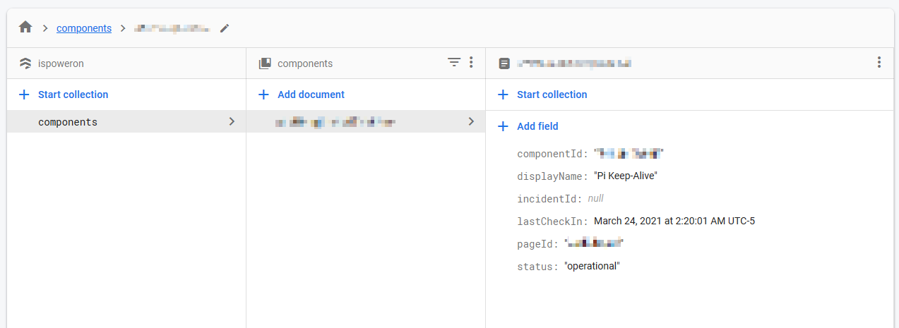

isPowerOn
=========

Serverless API to track if anything you want is responsive or not with StatusPage.io 

## What is this?

During the [2021 Texas Power Crisis](https://en.wikipedia.org/wiki/2021_Texas_power_crisis), I wanted a simple way to be able to tell if my home's power had returned or not while staying at my parents house. Originally, I had a Raspberry Pi setup with a [cronjob](https://en.wikipedia.org/wiki/Cron) that spammed my phone with the Telegram API using [`curl`](https://en.wikipedia.org/wiki/CURL).

This is an improvement on that concept.

## How does this work?

### Server-side logic

Using [Firebase Functions](https://firebase.google.com/products/functions) and [Firestore](https://firebase.google.com/products/firestore), each device/location/app/whatever will correspond to a [Component](https://support.atlassian.com/statuspage/docs/what-is-a-component/) on StatusPage.io.

This requires your device/service/whatever to regularly send out "*checkIn*" requests to this serverless API. If a component has not "checked in" in within a predefined interval, it will be updated on StatusPage.io and an [Incident](https://support.atlassian.com/statuspage/docs/what-is-an-incident/) will be created. The next time that component "checks in", the Incident will be resolved and the component updated.

### Client-side logic

There barely is any! (That's the point!)

-  Run `crontab -e`

```
*/10 * * * * curl "https://YOUR_DATACENTER-YOUR_PROJECT_ID.cloudfunctions.net/concierge-checkIn?id=SomeRandomDocumentId"
```


## Setup

- Make a StatusPage.io account
- Create a Component that corresponds to the device/service/whatever you want to monitor (the group doesn't matter).
- Install dependencies (Node.js version 14 and NPM version 7 required):
  ```
  cd functions/
  npm install
  ```
- Deploy this project to firebase using the Firebase CLI.
  - See: https://firebase.google.com/docs/functions/get-started
  - Once installed and logged in, you're going to want to run:
    ```
    firebase deploy
    ```
- [Acquire a StatusPage.io API key](https://developer.statuspage.io/#section/Authentication/api_key)
- Save that API key to the firebase functions config:
  ```
  firebase functions:config:set statuspage.key="12345-6789-abcd-efgh-99999999"
  ```
- Redeploy for changes to take effect:
  ```
  firebase deploy
  ```
- Locate the full URL for the `/concierge-makeReservations` endpoint for your Firebase function. It should be the one with the `*.cloudfunctions.net` domain.
- Once located, find the `page_id` of your StatusPage.io page. This can be found by going to `https://manage.statuspage.io/` and paying attention to the url slug in this pattern:
  ```
  https://manage.statuspage.io/pages/PAGE_ID_GOES_HERE/incidents
  ```
- Now that you have the full URL of your `makeReservations` function and the `page_id`, combine them into a URL and open it in your browser.
  ```
  https://YOUR_DATACENTER-YOUR_PROJECT_ID.cloudfunctions.net/concierge-makeReservations?pageId=PAGE_ID_GOES_HERE
  ```
- Once you've opened that in your browser and the page completely loads, your StatusPage.io Components should have imported into the [Firebase Firestore console](https://firebase.google.com/docs/firestore/using-console). You will need to open the `makeReservations` URL again every time you add a new Component that you want to monitor.
- Now that your components are added to the Firestore database, you should see a collection named `components`:

  
- Copy or make note of the document name in the database (the part that's pixelated)
- With the document name noted, you can now produce the "checkIn" URL that can be `curl`'d in a crontab.
  ```
  https://YOUR_DATACENTER-YOUR_PROJECT_ID.cloudfunctions.net/concierge-checkIn?id=DOCUMENT_NAME_GOES_HERE
  ```
- Make sure that whatever service you want calls this regularly to be marked as "online".